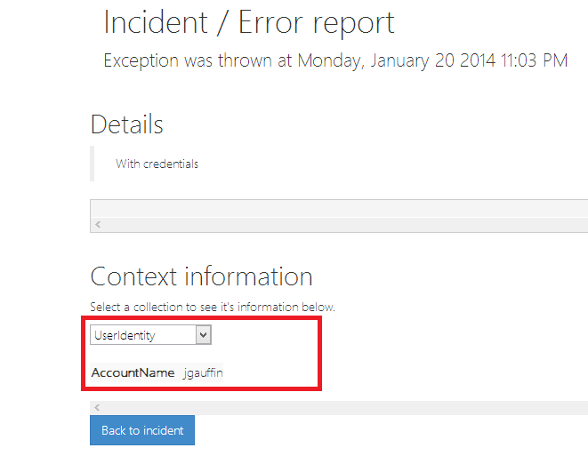

# Custom ContextCollection

This sample demonstrates how you can include custom context collections with the reports that are uploaded to our service.

You can see the reports live by logging into http://onetrueerror.com with `demo` as name and `demo` as password.

